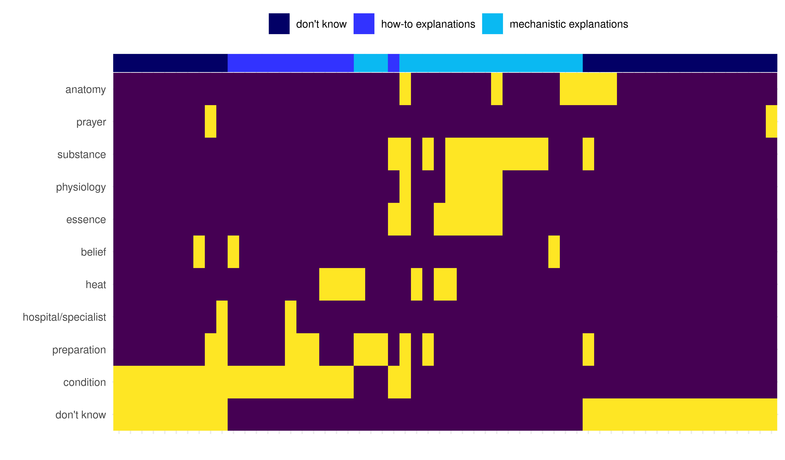

```{r setup, echo=FALSE, warning=FALSE, message=FALSE}
knitr::opts_chunk$set(echo=FALSE, warning=FALSE, message=FALSE)
knitr::opts_chunk$set(fig.pos = 'p') # Places figures on their own pages
knitr::opts_chunk$set(dpi=600) # Figure resolution and size
knitr::opts_chunk$set(fig.env="figure") # Latex figure environment
knitr::opts_chunk$set(dev = "cairo_pdf")
```

# Introduction

In his seminal work on comparative religion, Frazer (1890) considered shamans and other religious practitioners in small-scale societies to be performance artists without serious regard for scientific knowledge, notably stating that for them "magic is always an art, never a science" (p. 34). These individuals, who we refer to as *religious specialists*, invoke the supernatural when healing illnesses and performing divination rituals [@eliadeShamanismArchaicTechniques2004; @winkelmanCrossculturalStudyMagicoreligious]. In the anthropological literature, \emph{religion} is a family resemblance category referring to traditions that involve ritual techniques for diagnosing the unknown, and apparently supernatural concepts such as spirits, souls, and witchcraft [@needham1975polythetic]. In traditional societies, most religious specialists deal with practical problems such as health, illness, crop failures, or natural disasters [@boyer2020informal; @peoplesHunterGatherersOriginsReligion2016].

In practical task domains that can involve high stakes and uncertainty, such as medicine, it is unclear why specialists should use "religious" methods, particularly if using "scientific" ones would be a more effective strategy.\footnote{\emph{Science}, as used here and throughout this paper, refers broadly to a method for creating knowledge, in the form of predictions and explanations, from previous observations. We use scare quotes around terms such as “religion” and “science” because despite their widespread uses in the literature, these concepts are often ambiguous and ill-defined. As we discuss further below, they might also substantially overlap with each other in many cross-cultural contexts.} This seems especially puzzling for evolutionary theorists: What advantages, if any, could religious specialists gain by relying on religious methods for healing? And conversely, why should laypersons find religious methods convincing and/or pay costs to religious specialists as patrons? We address these questions by focusing specifically on specialists who deal with health, medicine, and illnesses.

## A standard account: The subjective appeal of magical healing

An influential evolutionary explanation of religious specialization focuses on the origins of "magical thinking" as a cognitive byproduct. According to this view, human cognition is susceptible to supernatural beliefs and superstitious behaviors, which themselves are evolutionary byproducts of adaptive error management strategies: When an outcome is uncertain and false negatives are costly, adaptive strategies can include over-attributing agency to non-agents [@guthrieFacesCloudsNew1995] and spuriously inferring causes that appear superstitious to more knowledgeable observers [@fosterEvolutionSuperstitiousSuperstitionlike2009]. More generally, humans' adaptive capacities for reasoning about other minds, material artifacts, physical processes, and biological kinds might make religious ideas cognitively appealing [@boyerEvolutionaryPerspectivesReligion2008; @kelemen2004children].

Most proponents of this view also argue that cognitive byproducts alone are insufficient for religion to gain traction, because the space of possible religious ideas vastly exceeds the space of those that culturally evolve in reality to become sacred, socially sanctioned religious ideas [@atran2002gods]. A complete evolutionary account of religion therefore requires an explanation of the social origins of religious institutions, in addition to its cognitive origins [@norenzayanBigGodsHow2015].

Explanations that complement the cognitive byproduct account focus on the social benefits of participating in religion, such as improved within-group cooperation, that offset the potential costs of participating in rituals or observing taboos [@chwe2013rational; @wilson2010darwin]. Religious specialists sometimes play a coordinative leadership role by publicly performing rituals, facilitating the spread of some religious beliefs over others by giving them "rehearsal time" at the social group level [@dennett2006breaking]. These rituals are often costly, and one possible reason for religious specialists to gain traction is based on the subjective appeal of their displays to laypersons, which might attract the attention of admiration of potential followers (credibility enhancing displays; @henrichEvolutionCostlyDisplays2009; @singhCulturalEvolutionShamanism2018). The displays made by religious specialists, and the behaviors they inspire among religious followers, can provide societies with real benefits, such as improved between-group competitiveness [@norenzayanBigGodsHow2015], improvements to the local ecology [@purzyckiEvolutionGodsMinds2016], social bonding, and/or ingroup signals of cooperative intent [@sosisSignalingSolidaritySacred2003].

### Convincing displays of supernatural ability?

For serious yet rare events whose causes are opaque, such as many illnesses, laypersons could benefit by gambling on the advice of knowledgeable, trustworthy sources of information or aid [@lightnerAcculturationMarketIntegration2021; @morinHowTraditionsLive2015]. Magical thinking about uncertain and high-stakes phenomena makes laypersons susceptible to exploitation, however, providing an opportunity for aspiring religious specialists to gain an advantage by using "plausible-seeming magical practices" that pander to intuitions about invisible and malevolent agents, with whom the specialist can negotiate to treat the illness. On this view, the religious specialist can gain prestige and patronage because the effectiveness of a magical practice is difficult to evaluate and/or prone to confirmation bias [@strimlingRepeatedLearningMakes2009; @singhCulturalEvolutionShamanism2018].

Religious specialization might therefore represent a reliably-occurring, culturally evolved opportunity for adapting to people's intuitions and convincing laypersons that the specialist can influence otherwise unpredictable and high-stakes outcomes [@singhCulturalEvolutionShamanism2018]. Professionalizing this opportunity can (and often does) involve religious specialists who not only convince others of their supernatural abilities, such as healing, but also gain deference through fears of their abilities to impose harms and/or resources through patronage [@singhMagicExplanationsEvil2021].

Exploitation of cognitive biases fails to explain some important phenomena, however: Why do the culturally evolved roles of religious specialists so frequently relate to a high-stakes domain such as healing? And more importantly, if religious specialists are performers who use culturally evolved myths and customs to "hack our psychologies and placate our anxieties" [@singhCulturalEvolutionShamanism2018, p. 17], then why should laypersons, who are often willing to pay for the specialist’s services, settle for the "religious" healers whose methods are not necessarily geared toward actually treating illnesses, especially if a more "scientific" alternative would be more effective?

## An alternative account: Religion, ethnomedicine, and a market for useful services

Another explanation for religious specialization avoids the assumption that “science” and “religion” entail usefully distinct types of knowledge across cultures. According to this view, in many cultures and throughout much of history, the religious healer *is* the scientific healer, and patronage from laypersons is based on the efficacy of the healer’s treatments.\footnote{We use "efficacy", like the standard definition in medicine, to refer to the effectiveness of a treatment method in obtaining its desired outcome.} We refer to this idea as the *efficacious healing* hypothesis. People everywhere use folk scientific knowledge to make causal inferences and navigate uncertainty [@sperberCausalCognitionMultidisciplinary1995; @szollosiPeopleIntuitiveScientists2020], and traditional knowledge systems are widely interpreted as providing useful, practical solutions for recurring challenges in a given socioecological environment [@glowackiEmergenceLocallyAdaptive2020; @lansingEmergentPropertiesBalinese1993; @rappaportPigsAncestorsRitual1968; @stewardTheoryCultureChange1972].

In many societies, local specialists master elaborate systems of culturally evolved knowledge that require costly investments of time, resources, and opportunity costs [@lightnerConceptualKnowledgeEthnoscientificinreview]. Cross-culturally, medicine is one of the most common domains of folk scientific knowledge [@ericksonEthnomedicine2007; @singerCompanionMedicalAnthropology2011], and most adults in traditional and small-scale societies have at least some knowledge of medicinal plants and health-related practices, i.e., *ethnomedical knowledge* [@conklin1980folk; @lozadaCulturalTransmissionEthnobotanical2006; @medinNativeMindBiological2004]. Nevertheless, individual levels of ethnomedical knowledge tend to vary within these populations, and previous work, e.g., among Tsimane horticulturalists and BaYaka foragers, has showed that higher levels of ethnomedical knowledge tend to be associated with better health outcomes for adults and their children [@mcdade2007ethnobotanical; @reyes2008non; @salali2016knowledge]. In many cases, these societies have individuals who heavily invest in gaining ethnomedical knowledge, and specialize in using efficacious, culturally evolved strategies to alleviate locally salient diseases [@lightnerConceptualKnowledgeEthnoscientificinreview; see also @berlinMedicalEthnobiologyHighland2015]. We refer to these individuals, whose extensive medicinal knowledge can include herbal medicines, animal venoms, and human physiology, as *ethnomedical specialists*.

### A market for efficacious ethnomedical specialists

Much research has focused on the cognitive, social, and ecological factors behind scientific knowledge [@carruthersCognitiveBasisScience2002; @heintzScientificCognitionCultural2007;  @nersessianCreatingScientificConcepts2010; @thagardMindSocietyBrainsSocial2019], but the relationship between specialists and laypersons is less clear, particularly among ethnomedical specialists. What benefits, if any, do ethnomedical specialists provide to laypersons in traditional societies, and what benefits do the specialists gain in return?

People might favor knowledgeable ethnomedical specialists because they provide valuable services when stakes are high, especially for know-how that is inefficient to learn individually. If a service resolves a sufficiently uncommon and serious problem, such as an unlikely but deadly illness, then knowing how to diagnose and heal the illness can favor a market for specialized knowledge: for the average individual, the cost of mastering these skills might be greater than the cost of paying a specialist to do so, if and when the serious event arises. Ethnomedical specialists can therefore improve their own prospects by professionalizing an opportunity to provide valuable knowledge-based services, such as efficacious healing techniques, to their clients in exchange for benefits, such as payments or prestige. Clients do not necessarily learn the skills or knowledge underlying the service -- patients who receive diagnosis and treatment do not thereby become doctors -- but they might evaluate specialists based on individual-level feedback when they are recipients of specialists' services. We refer to this idea, which builds on the work of many others, as the *market for specialists* hypothesis [see, e.g., @hagenLeadershipPrestigeMothering2019; @sugiyamaIllnessInjuryDisability2004; @toobyFriendshipBankerParadox1996a].

Another view of the specialist-layperson relationship is that it is akin to mentorship. On this view, which we refer to as the *mentorship* hypothesis, experts possess valuable skills, and laypersons exchange deference for proximity so as to better acquire the skills for themselves [@boydCulturalNicheWhy2011]. Laypersons are not patrons *per se*, but are acolytes who can use ecologically rational cues to determine who to learn from: People might decide based on prestige [@henrichEvolutionPrestigeFreely2001] and/or who others are copying [@henrichEvolutionConformistTransmission1998].

### Is ethnomedicine “religious”?

The extent to which ethnomedical specialists resemble religious specialists is unclear. Historically, traditional scientific knowledge systems in Western and non-Western societies have included intuitive humoral and sympathetic concepts, e.g., among ancient Greeks, Quetzi Mayan, Ayurvedic, and Amharic Debtera medical knowledge systems [@atranNativeMindCultural2008; @jaiswalGlimpseAyurvedaForgotten2016; @youngMagicQuasiProfessionOrganization1975]. To the modern Western observer, traditional ethnomedical concepts about infection, for example, might be easily interpreted as "religious" or "supernatural" based on their resemblances to spirits or magical contagion [@gottliebAfterlifeWhereWe2004; @boyerMindsMakeSocieties2018].

Conversely, religious healers such as shamans and priests employ esoteric and supernatural concepts in their practices, the medicinal and/or psychological benefits of which might help explain the evolution of religious ritual [@mcclenonShamanicHealingHuman1997; @winkelmanShamansOtherMagicoReligious1990]. In at least some cases, they also display evidence of technical expertise in diagnosing and effectively curing illnesses with herbs [@andritzkySociopsychotherapeuticFunctionsAyahuasca1989; @blackwellShamanismEfficaciousExceptionalism2018].

We refer to the idea that ethnomedical specialists are also religious specialists (and vice versa) as the *religiosity* hypothesis. If religious specialists are also the scientific ethnomedical specialists, however, then how can we explain why they use supernatural theories of disease instead of naturalistic theories? Should laypersons weigh the relative importance of more "scientific" specialists vs. more "religious" ones?

### A misleading distinction between science and religion

Social sciences have long assumed that practical and scientific concerns vs. religious ones are distinct aspects of both culture and psychology [e.g., @frazerGoldenBoughStudy2003; @jamesVarietiesReligiousExperience2009; @weber2009max], and have largely developed their evolutionary theories of science separately from their evolutionary theories of religion.

This separation between scientific and religious practices has been carried forward to modern theories about distinct types of cognition [@funkReligionScienceHighly2015; @shenhavDivineIntuitionCognitive2012; @uzarevicPsychologyNonbelievers2020], or at least of two separate positions on a continuum where religion is developmentally natural and science is not [@mccauleyWhyReligionNatural2013]. This separation of religion, which seems intuitive, vs. science, which does not, might appear patently obvious and only motivate questions about *how* religion and science relate to each other [for a range of perspectives, see @barbourIssuesScienceReligion1966; @coyneFaithFactWhy2016; @draperHistoryConflictReligion2009; @gouldRocksAgesScience2011].

It is not obvious, though, that religion and science involve distinct types of cognition across cultures. Although scientific and religious *institutions* have a long and complex history of political and ideological cooperation and conflict among Western societies, the distinction between scientific and religious *knowledge* is relatively recent. Influential Western scientists, including Newton, Boyle, Hooke, and Kepler, were deeply religious and viewed much of their work as supplying evidence for a divine and transcendent creator [@gillispie1996genesis]. The term "scientist" itself was not widespread until after the British Association's William Whewell coined it around 1834 as a suitable replacement for the term “natural philosopher”. The term was meant to imply specialized commitments to creating knowledge (*scientia*, in Latin), analogous to the artist's commitment to creating art [@snyderPhilosophicalBreakfastClub2012].

It is therefore not obvious that a distinction between “science” and “religion” is useful for analyzing beliefs and institutions in most non-Western societies. The modern Western institutional separation of science and religion might misleadingly lead theorists to carry this separation over into their evolutionary perspectives of cognition [@boyerMindsMakeSocieties2018; @sperberCuttingCultureJoints2018]. In small-scale societies, anthropologists have documented uses of magic and religion for practical tasks involving high-stakes risk and uncertainty [@evans-pritchardNuerDescriptionModes1940; @malinowskiArgonautsWesternPacific1932], often integrating *natural* and *supernatural* concepts into unified explanatory frameworks [@legareCoexistenceNaturalSupernatural2012; @tucker2015ecological].\footnote{While \emph{supernatural} is arguably an ethnocentric concept (see Sperber 2018), it is nevertheless central to defining religious belief systems in the existing literature. Indeed, this objection is an empirical claim, rather than an assumption, which we investigate in the present study.} In a classic example, Zande farmers understand the natural causes of unfortunate granary collapses (termites), but particular *occurrences* of these collapses demand supernatural explanation (witchcraft) [@evans-pritchardWitchcraftOraclesMagic1976].

At cognitive and behavioral levels, Westerners also integrate "scientific" and "religious" concepts by resorting to ritual in times of high-stakes uncertainty [@gmelchBaseballMagic1971], appearing to use magical thinking in experiments [@rozinOperationLawsSympathetic1986], and merging natural and supernatural explanations for life, death, and disease [@legareCoexistenceNaturalSupernatural2012].

### Mental models about abstract and supernatural phenomena

The alternative account, involving a market for efficacious healers, therefore asserts that *science* and *religion*, while corresponding to nominally distinct institutions among Western societies, are fundamentally products of a cognitively integrated system whose evolved function is to acquire, exchange, and apply locally relevant social and ecological knowledge. Many anthropologists argue that religion should not be seen as a unitary phenomenon, nor that most societies have had religions in a useful sense of the term. Instead, small-scale societies, in which religion is not a hegemonic institution, have a variety of ideas, practices, and institutions that are loosely described to varying degrees as “religious”, typically when interpreted by Western observers [@bloch2008religion; @boyer2020informal; @sperberCuttingCultureJoints2018]. As a culturally specific system for gaining practical knowledge [@heintzIntroductionWhyThere2004], "science" might or might not include “religious” concepts.

It is unclear that cross-cultural and evolutionary perspectives of scientific knowledge should exclude religious belief, and vice versa. Applied to ethnomedicine, the cognitive function of “supernatural” theories of disease might not be relevant to a broader religion (or religious style of thinking) at all. Instead, it might be to mentally model and make inferences about rare or abstract phenomena whose causes are unobservable (e.g., infection, mental illness, probability, counterfactuals). These mental models are especially practical where invisible disease-causing agents present a frequent and severe challenge to biological fitness, as we might expect, for example, in environments with high pathogen stress.


## Study aims and hypotheses

Ethnomedical specialists are local experts for diagnosing and healing serious illnesses. In many cases they use supernatural theories of disease, but why they do is unclear. A standard account is that supernatural theories are intuitive. An alternative account, which we outlined above, is that supernatural theories can be genuinely useful for thinking about phenomena whose causes are mysterious and unobservable. Such useful knowledge might be an asset for conferring benefits, e.g., by diagnosing and treating clients in a market for practical solutions to rare and serious problems, and/or by imparting insights to acolytes in the context of mentorship.
In two complementary studies, we assessed the foregoing hypotheses about the roles of religiosity, efficacy, and knowledge specialization among ethnomedical specialists and their potential patrons. Study 1 was a cross-cultural study of ethnographic data from the electronic Human Relations Area Files (eHRAF), and study 2 was a field study with Tanzanian Maasai pastoralists.

In study 1, we surveyed a wide range of cross-cultural ethnographic data to assess the levels of evidence for the roles of *religiosity*, *efficacy*, *market specialization*, and *mentorship* among ethnomedical specialists. We  searched the eHRAF exclusively for examples of ethnomedical specialists rather than religious specialists, meaning that any resulting ethnographic examples of religious specialists, efficacious healers, or prestigious mentors were not a consequence of our search query, but a consequence of their association with ethnomedical specialists in the ethnographic record.

In study 2, we honed in on a single population to investigate the criteria patrons use to select among ethnomedical specialists, along with their cultural models of medical treatments, in greater detail than we could in study 1. Specifically, we interviewed 84 Tanzanian Maasai pastoralists about who they would favor among local medicinal specialists in the region if they were seriously ill and why. We also assessed the extent to which their cognitive models of disease resembled supernatural theories of disease, asking participants to detail their explanations for how a medicine for a common ailment works. Additionally, we introduce qualitative data from interviews with two local Maasai ethnomedical specialists and a traditional religious specialist. These interviews were conducted in a population undergoing a cultural and economic transition from pure cattle-based subsistence and trade, and toward a more Christian and cash-based market economy [@hodgsonChurchWomenGendered2005].

# Study 1: Cross-cultural data

```{r ehrafanalysis}
source('eHRAF-analysis2.R')
```

We used cross-cultural data from the eHRAF to investigate the hypotheses that ethnomedical specialists are *religious*, offer *efficacious* treatments, compete for patrons in a *specialized market*, and are prestigious *mentors* who teach acolytes. We focused exclusively on ethnographic descriptions of ethnomedical specialists (i.e., without attempting to search for religious specialists), so we compared the extent to which each of these hypotheses, which were not part of our search terms, were supported by ethnographic evidence.

We also conducted extensive exploratory analyses to gain descriptive insights about ethnomedical specialists. For example, we considered the correlates of supernatural theories of disease, religiosity, and acculturation, with acculturation interpreted as an "expansion" of pre-existing markets for ethnomedical specialists (e.g., via the introduction of infrastructure, hospitals and clinics, and/or foreign medicinal practices).

## Methods

We searched for ethnographic data about ethnomedical specialists from the eHRAF, a digitized database of primary ethnographic documents from over 400 cultures around the world. We restricted our search to the Probability Sample Files (PSF), a stratified subset of 60 cultures in the eHRAF that includes one randomly selected culture from 60 geographically diverse areas [@narollProposedHRAFProbability1967]. Documents in the eHRAF are coded at the paragraph level using an Outline of Cultural Materials (OCM) hierarchically organized coding scheme, containing several hundred numeric codes assigned to unique and specific topics [@murdockOutlineCulturalMaterials2006].

Previously, in a study of ethnoscientific expertise [@lightnerConceptualKnowledgeEthnoscientificinreview], we searched the PSF for 68 OCM codes that could plausibly result in descriptions of expertise in conceptual, folk scientific knowledge domains, such as ethnobotany, ethnometeorology, and theories of disease. We narrowed this search using six keywords that refer to highly knowledgeable experts in those domains, such as "expert\*", "specialist\*", and "practitioner\*".\footnote{The "*" is a wildcard that would match any suffix.} We did not include any OCM codes or search terms corresponding to religious topics. See the supplementary information (SI) for a more in depth summary of our search protocol, which produced 547 text records in total (text records were generally short, usually comprising one to a few contiguous paragraphs).

Whereas @lightnerConceptualKnowledgeEthnoscientificinreview broadly investigated the social characteristics of knowledge specialists that might explain knowledge specialization as an evolutionary strategy, and did not focus on their religious or supernatural qualities, here we restricted our investigation to *ethnomedical specialists*, resulting in `r nrow(d)` text records describing specialists with ethnomedical expertise. We included the 42 coded variables from @lightnerConceptualKnowledgeEthnoscientificinreview that characterized the knowledge domains and attributes (e.g., uses of plant knowledge) and social attributes (e.g., prestige) of ethnomedical specialists. We added `r ncol(d)-42` variables that characterized religious and supernatural dimensions of ethnomedical specialization, variables that would conceivably be important to patrons, such as the benefits and costs provided and imposed by specialists, and variables that indicated acculturation. This produced a total of `r ncol(d)` variables. See the SI for examples illustrating the text record coding procedure.

Our resulting dataset represented ethnomedical specialists in 47 cultures, whose geographic distribution and subsistence strategies are shown in figure \@ref(fig:worldmap). To assess the extent to which ethnomedical specialists were *religious*, provided *efficacious services*, engaged in a *specialized market* for payment and patronage, and participated in *mentorship* as prestigious teachers, we grouped our `r ncol(d)` variables based on relevance to each of these hypotheses (and, in some cases, their opposing hypotheses; see figure \@ref(fig:ehraftilevars)). Similar to the variables in @lightnerConceptualKnowledgeEthnoscientificinreview, many of these variables related to knowledge attributes vs. social attributes, and to incentives vs. disincentives among laypersons for patronizing a specialist. We therefore also grouped our `r ncol(d)` variables into these four useful and additional categories. (We discuss our hypotheses and their corresponding variables, along with these four additional variable groupings, in more detail in the SI.) See figure \@ref(fig:ehraftilevars) for our coded variables and their corresponding hypotheses, along with the four additional variable groupings that we used to categorize our variables in the descriptive results for study 1.

\begin{landscape}

```{r worldmap, fig.cap='Geographic region of each culture included in our dataset of ethnomedical specialists. Colors and shapes indicate subsistence strategy for each cultural group, and sizes indicate the number of text records for each culture in our dataset.', fig.align="center", fig.height=10, fig.width=12}
eHRAF_world_map
```

\end{landscape}


```{r ehraftilevars, fig.cap='Coded variables about ethnomedical specialists are listed along the y-axis. Groups of variables, which include the four hypotheses outlined in the Introduction, two contrasting hypotheses (low status and inefficacious healing, which contrast with prestigious mentors and efficacious healing, respectively), and four useful categories for describing levels of support for specialist attributes (knowledge vs. social attributes) and client incentives vs. disincentives, are listed on the x-axis. Filled cells indicate which variables are included in each group of variables. Note that many variables fall into multiple variable groupings.', fig.align="center", fig.height=8, fig.width=10}

eHRAF_variables
```

The first and second authors independently coded each text record for presence/absence (1/0) on each of our `r ncol(d)` variables, which generated a `r round(ps.total.agree$value,1)`% match with a Cohen's kappa indicating moderate agreement ($k$ = `r round(ps.total.kappa$value,2)`). Although most variables represented the presence or absence of evidence for a variable, in a few cases, it was feasible to code variables with evidence against one of our coded variables. We coded on variables for *prestige* and *specialist confers benefits*, for example, but we also coded on variables for *low status*, or "anti-prestige", and *specialist imposes costs*. See the SI for more details about interrater reliability. Afterward, the coders discussed and reconciled all disagreements to produce the coded dataset used in our analyses.

Although most of our analyses were at the text record level, we were also interested in analyses at the culture level. We used the Standard Cross Cultural Sample (SCCS) to acquire variables at the culture level. The SCCS, which is entirely distinct from the eHRAF, is based on ethnographic data from 186 societies. As of its latest installment, it contains 1781 variables (presence/absence, ordinal, continuous, and categorical) that were each coded for each society in the dataset at the culture level [@dplace2_SCCS]. The SCCS covers many of the same cultures as the eHRAF, but it differs from the eHRAF because it contains culture-level data (e.g., the social complexity score of each culture), whereas the eHRAF contains ethnographic texts coded by subject at the paragraph level (e.g., multiple primary sources discussing social organization). In this study, the SCCS contained 44 of the 47 cultures in our eHRAF dataset, so text records from 3 cultures were excluded from analyses using the SCCS data.\footnote{The eHRAF data is our primary dataset of coded data from ethnographic text records about ethnomedical specialists, and should not be confused for the SCCS dataset that we used for this particular cross-cultural analysis. All references to "the data" or "the dataset" in Study 1 should therefore be assumed to be the eHRAF dataset, unless it is specified as the SCCS dataset.}

### Statistical analyses

Our dataset comprised a `r nrow(d)` row by `r ncol(d)` column binary matrix, where each row represented one text record on ethnomedical specialists, and each column represented one coded variable (0=no evidence, 1=evidence). 

We analyzed this matrix in four ways. First, to assess the levels of evidence for each of the variables in figure \@ref(fig:ehraftilevars), we computed the proportion of text records that provided evidence for each variable. Second, and relatedly, we computed the mean proportion of evidence for each of the variable groupings and descriptive categories that are shown in figure \@ref(fig:ehraftilevars) (which we termed its *total score*). 

Third, we used hierarchical and penalized (elasticnet) regression models to determine the association of supernatural and religious concepts with other dimensions of ethnomedical specialization; the association of supernatural and religious concepts with culture-level factors, such as continental region, mode of subsistence, and cultural complexity (using variables obtained from separate SCCS data, and a principal components analysis (PCA) of these variables; @kirbyDPLACEGlobalDatabase2016); and the association of acculturation with dimensions of ethnomedical specialization. These exploratory analyses aimed to identify which variables, both at the text and cultural levels, were associated with ethnomedical specialists who used supernatural theories of disease.

Finally, to examine structure in our entire data matrix, i.e., to determine which groups of variables tended to have evidence in the same text records and therefore might indicate important abstractions about ethnomedical specialization, we used a network clustering technique known as a minimum spanning tree (MST), in which only similar variables (the vertices) are connected to each other. We then identified “clusters” of variables by visual inspection of the MST, seeking groups of adjacent variables that were conceptually related. This exploratory analysis allowed us to create a purely data-driven cross-cultural taxonomy of ethnomedical specialists.

For a full description of our statistical analyses, see the SI. We also provide all data and R code: https://github.com/alightner/ethnomedicine-magic.

## Results

The text record level evidence for each of the `r ncol(d)` coded variables, which we broadly characterize as knowledge and social attributes, are shown in figure \@ref(fig:ehrafTotalEvidence). We found high levels of evidence for supernatural theories of disease, uses of botanical knowledge, and narrow specialization. Text records frequently described multiple specialists who were distributed among separate roles with complementary specializations, often with collaborative relationships. In some cases, ethnomedical specialists were situated in a hierarchy with prestige, and engaged in public performances. Sometimes knowledge was clearly restricted to the specialists -- in some of these cases the knowledge was intentionally kept secret -- and sometimes the specialists were simply more knowledgeable and/or skilled compared to others in their society (figure \@ref(fig:ehrafTotalEvidence)A).

Most ethnomedical specialists (`r perc_supernatural`%) used at least some "supernatural" concepts, such as witches, spirits, or deities. Some ethnomedical specialists had religious leadership roles (`r perc_religious_leader`%) and/or performed divination rituals during times of uncertainty (`r perc_divination`%). When we grouped our variables according to hypotheses, their total scores showed relatively high levels of evidence for a market for specialists, efficacious healing, and religiosity. We found relatively less evidence for and against mentorship, and for inefficacious healing practices. See figure \@ref(fig:ehrafTotalEvidence)B.

\begin{landscape}

```{r ehrafTotalEvidence, fig.cap='Percentage of text records (purple) and cultures (orange) with evidence for each variable. A: Variables organized by  knowledge attributes (upper facet) and social attributes (lower facet) among ethnomedical specialists in our eHRAF data sample. B: Variables organized by hypothesis. Total model scores are percentages of text records with evidence for any variable defining a given model. Error bars are +/- 2 SE. See the SI for more details on the estimate procedures.', fig.align="center", fig.height=8, fig.width=9}
eHRAF_specialists / eHRAF_modelPlot + patchwork::plot_annotation(tag_levels='A')
```

\end{landscape}

### Religion and the supernatural among ethnomedical specialists

The elasticnet regression model with religion scores for each text record as the outcome variable showed that variables most positively associated with evidence for religion were ethnospecialists assisting with uncommon and serious problems, imposing costs on others, specializing in theories of psychology, and possessing secretive knowledge. Religious ethnomedical specialists were also positively associated with multiple specialists whose knowledge was distributed across multiple roles. Predictors that were most negatively associated with evidence for religion were acculturation, purchased knowledge, and healing injuries (figure \@ref(fig:ehrafreligionLasso)A). Neither regional variation nor subsistence strategy were associated with substantial variation in religion scores at the culture level (figures \@ref(fig:ehrafRegionSub)A and \@ref(fig:ehrafRegionSub)B).

The elasticnet regression model with presence/absence of supernatural theories in each text record as the outcome variable showed that the supernatural was positively associated with divination, costly rituals and initiation processes, and religious leadership. This model also showed that the supernatural was negatively associated with acculturation and evidence of success in their healing practices. See figure \@ref(fig:ehrafreligionLasso)B. At the culture level, ethnomedical specialists' uses of the supernatural did not systematically vary by region or subsistence strategy, although intensive agriculturalists appeared to have less evidence for supernatural healing compared to horticulturalists (figures \@ref(fig:ehrafRegionSub)C and \@ref(fig:ehrafRegionSub)D).


\begin{landscape}


```{r ehrafreligionLasso, fig.cap='A: Regression coefficients from the elasticnet model of religiosity, where each presence/absence variable along the y-axis is a predictor and the total score for religiosity in each text record was the outcome. B: Regression coefficients from the elasticnet model, where each presence/absence variable along the y-axis is a predictor and presence of evidence for supernatural theories of disease used by ethnomedical specialists is the outcome. Estimates are reported as odds ratios. Note that the x-axis is log-scaled.', fig.align="center", fig.height=9}

(eHRAF_religionScorePlot + theme_bw(10)) /
  (corrSupernatural_FULL + theme_bw(10)) +
  patchwork::plot_annotation(tag_levels='A')


```


```{r ehrafRegionSub, fig.cap='Estimated marginal means of religiosity scores by geographic region (A) and subsistence strategy (B) at the text record level, and for the proportion of supernatural theories of disease by geographic region (C) and subsistence strategy (D). Estimates are based on separate generalized linear mixed models with cultures as random intercepts. Panels A and B are based on poisson regression estimates, and panels C and D are based on logistic regression estimates. Error bars are +/- 2 SE.', fig.align="center", fig.height=10, fig.width=12}

(Regional_emmeans + Subsistence_emmeans) /
  (Regional_ReligionScore + Subsistence_ReligionScore) +
  patchwork::plot_annotation(tag_levels='A')


```

\end{landscape}

### Supernatural theories of disease are about the uncertain and the unobservable

Ethnomedical specialists often specialized in specific knowledge or skill domains, which included conceptual, ethnoscientific domains such as plant and animal knowledge. Supernatural theories of disease were more frequent in domains that are unobservable and uncertain, such as divination, misfortune, uncertainty, and psychology, and less frequent in domains involving some observable motor activity, such as physical injuries and childbirth (figure \@ref(fig:ehrafdomainSupernaturalPlot)).


```{r ehrafdomainSupernaturalPlot, fig.cap='Graph representing commonly occurring domains of knowledge and skill that co-occurred with medicinal knowledge in text records in our dataset. Vertices indicate domains that occurred in at least ten text records, and vertex size corresponds to the number of text records including that domain. Vertex colors indicate the proportion of supernatural theories of disease that was associated with each knowledge domain. Each edge indicates that a pair of knowledge/skill domains co-occurred in at least one text record. Edge widths indicate the frequency with which each domain pair co-occurred, as determined by the number of text records describing them together, and normalized by the maximum frequency = 113.', fig.align="center", fig.height=6, fig.width=9}
eHRAF_domain_supernatural
```

The first two components of a PCA of the 186 cultures in the SCCS data (see the SI) were interpretable as *culture complexity and scale* (PC1) and *pathogen stress and proximity to the equator* (PC2). See figure \@ref(fig:sccsPCAloadings). We plotted the PC1 and PC2 values of the 44 cultures that were also in our eHRAF sample of ethnomedical specialists (3 cultures were not included in the SCCS). The eHRAF cultures that were higher on PC2 (i.e., higher pathogen stress, closer to the equator) appeared to account for many of the above-average proportions of text records with supernatural theories of disease (figure \@ref(fig:sccsBiplot)), a pattern supported by a regression model of the supernatural variable as a function of PC1 and PC2, in which PC2 is a significant predictor of supernatural but PC1 is not (see the SI for details and caveats).


\begin{landscape}

```{r sccsPCAloadings, fig.cap='PCA loadings on the first two principal components in the SCCS dataset (sorted by loading values). A: PC1 corresponds to cultural complexity, population size, and societal scale. B: PC2 corresponds to pathogen stress, market and cash-based economies, and proximity to the equator (low absolute values of latitude).', fig.align="center", fig.height=10, fig.width=12}
SCCS_pcaloads1 / SCCS_pcaloads2 + patchwork::plot_annotation(tag_levels='A')
```


```{r sccsBiplot, fig.cap='PC1 (cultural complexity) and PC2 (pathogen stress/proximity to the equator) values for each of the 44 eHRAF cultures that were in our study and the SCCS. (Note that cultures with large positive PC2 values are closer to the equator.) Point colors indicate whether each culture had an above average proportion of supernatural theories of disease, and point sizes indicate the number of ethnographers who contributed the text records about a culture.', fig.align="center", fig.height=7, fig.width=9}
SCCS_biplot
```


\end{landscape}


### Incentives and disincentives for patrons and acolytes

We found substantial evidence for the *market for specialists* variables and some evidence for the *prestigious mentors* variables (figure \@ref(fig:ehrafTotalEvidence)B). Here, we investigate the social relationships among ethnomedical specialists and laypersons as potential patrons and/or acolytes. Incentives for patrons and acolytes to favor ethnomedical specialists were more common than disincentives, and specialists often possessed rare and valuable knowledge (figure \@ref(fig:ehrafincentivesPlot)). Modeling pairs of incentives and their opposing variables -- which were often disincentives -- suggested that ethnomedical specialists usually conferred benefits to others, gained patronage based on their reputations for efficacy, assisted with uncommon and serious problems, were more often successful at healing than they were unsuccessful, and rarely offered their services for free. There was modest evidence for teaching. Evidence for trustworthy vs. untrustworthy specialists was about evenly split (figure \@ref(fig:ehrafincentivesPlot)).

\begin{landscape}

```{r ehrafincentivesPlot, fig.cap='A: Text record and cultural group levels support for different incentives and disincentives that were associated with ethnomedical specialists in our eHRAF data sample. Points represent the percentage of evidence for that variable (the fixed-effect intercept from a generalized linear mixed effects model), and colors indicate whether that percentage is at the level of text record (percentage of text records with evidence), culture (percentage of cultures with evidence). B: Logistic regression coefficients among models of presence of evidence for vs. against each of the incentives for favoring ethnomedical specialists. Estimates are reported as odds ratios, and note that the x-axis is log-scaled. Error bars in both plots are +/- 2 SE.', fig.align="center", fig.height=6, fig.width=9}
eHRAF_laypersons / eHRAF_laypersons3 + patchwork::plot_annotation(tag_levels='A')
```

\end{landscape}

### Acculturation and market expansion

Acculturation was our proxy for expanding markets for ethnomedical specialists, and was positively associated with variables relevant to efficacious services, such as patronage based on efficacy, specialists with a reputation for efficacy, evidence of success and failure, and specialists conferring benefits to patrons. Acculturation was negatively associated with rare knowledge and variables relevant to religion, such as specialists prescribing ritual behaviors and supernatural theories of disease (figure \@ref(fig:ehrafAcculturation)).

```{r ehrafAcculturation, fig.cap='Fixed effects of acculturation on the proportion of text record evidence for each of the variables that had at least 10\\% support. Acculturation was the predictor in each GLMM and each variable listed along the y-axis was an outcome. Estimates on the log-scaled x-axis are reported as odds ratios. Error bars are +/- 2 SE, and colors indicate religious variables or specialized services.'}
eHRAF_acculturation
```

### Classifying ethnomedical specialists based on structure in the entire data matrix

Our MST revealed three branches of  similar variables, which we interpreted as a taxonomy of three broad types of ethnomedical specialists: the *efficacious healer*, the *feared diviner*, and the *prestigious teacher* (figure \@ref(fig:ehrafmsttaxonomy)). These interpretations are based on the variables within each of the three branches, which also contain informative sub-branches  comprising similar variables. These three broad types of ethnomedical specialist are equally close to two central nodes at the root of our entire taxonomy: *supernatural* theories of disease and *religious leadership*.

\begin{landscape}

```{r ehrafmsttaxonomy, fig.cap='Minimum spanning tree of the binary distance matrix of the variables in our dataset about ethnomedical specialists. Vertices represent variables, and vertex sizes correspond to levels of text record evidence for each variable. Edge lengths represent binary distances between variables. Annotations refer to our interpretations of each branch, which we interpret as a taxonomy of ethnomedical specialists.', fig.align='center', fig.height=9, fig.width=11}
knitr::include_graphics('images/ethnomedicineMST.pdf')
# eHRAF_mst
```

\end{landscape}

## Discussion of Study 1

Ethnomedical specialists were frequently sources of valuable knowledge, and provided efficacious treatments for specific, uncommon and serious illnesses, often for payment, supporting the *markets for specialists* and *efficacious healer* hypotheses. Specialists frequently used supernatural concepts and were also often religious leaders, supporting the religiosity hypothesis. We also found some support for prestigious mentorship, along with inefficacious healing and low status healers. 

Although our search terms for eHRAF texts deliberately did not include religious topics, ethnomedical specialization nevertheless was frequently described as a religious occupation (figures \@ref(fig:ehrafTotalEvidence) and \@ref(fig:ehrafreligionLasso)). Specialists were often formal or semi-formal religious leaders such as priests and shamans, and in fewer cases, held politically influential roles. Most specialists across cultures, regardless of region or subsistence strategy, invoked supernatural concepts in their theories of disease, such as witches, spirits, or deities, and many also performed “religious” behaviors, such as costly rituals and divination during times of uncertainty (figures \@ref(fig:ehrafreligionLasso) and \@ref(fig:ehrafRegionSub)).

We found that supernatural theories of disease were more common among ethnomedical specialists who deal with conceptual knowledge about unobservable phenomena, such as interpreting mental illnesses or providing herbal remedies for infections, and were less common among those who deal with observable phenomena, such as childbirth and physical injuries (e.g., bone-setting and wound mending) (figure \@ref(fig:ehrafdomainSupernaturalPlot)). Our PCA of the SCCS data found PC1 indexed culture complexity and scale, and PC2 indexed pathogen stress and proximity to the equator. Among cultures with higher pathogen stress (high PC2 values) -- and therefore higher chances of serious illnesses due to infection -- we saw a higher prevalence of supernatural theories of disease (figures \@ref(fig:sccsPCAloadings) and \@ref(fig:sccsBiplot)). We caution that pathogen stress and proximity to the equator are highly confounded with many other relevant factors, such as money-based economies and agricultural intensification (the latter two also loaded on PC2).

As high levels of support for the *market for specialists* hypothesis suggested, many ethnomedical specialists served a practical function in their societies, regardless of their *religiosity* (figure \@ref(fig:ehrafTotalEvidence)). Incentives for favoring an ethnomedical specialist generally outweighed the disincentives, which were usually payments rendered for healing or teaching. Markets for specialists seemed to intensify with acculturation, which was positively associated with variables relating to efficacy, and negatively associated with supernatural theories of disease (figure \@ref(fig:ehrafAcculturation)). Acculturation, as coded by the OCM scheme and our coding protocol, often referred to a presence of Western medicine, such as nearby hospitals and clinics. Services were frequently for uncommon and serious illnesses, rather than common or everyday health issues (figure \@ref(fig:ehrafincentivesPlot)). We speculate that it is more efficient for laypersons to outsource sufficiently uncommon and serious problems to specialists rather than individually or socially learn solutions themselves [see also @hagenLeadershipPrestigeMothering2019; @sugiyamaIllnessInjuryDisability2004].

We and others have argued that religion is at least partly an epiphenomenon of science, and the distinction between the two in Western cultures is primarily institutional (e.g., Sperber 2018; Boyer 2020). That is, supernatural concepts about “religious” entities vs. invisible forces invoked by “scientific” folk theories might share common cognitive characteristics (similar to the continuity hypothesis; Carruthers et al. 2002, p. 74). In our data, abstract essences such as bodily humors were not themselves coded as supernatural, but they frequently co-occurred with the descriptions of spirits, ghosts, or other invisible agents that were. Indeed, Western folk scientific concepts about germs often resemble sympathetic magic or agentive thinking [@gottliebAfterlifeWhereWe2004; @siegal200216], and folk psychological concepts often invoke hidden invisible forces such as souls.

We also found patterns that were not obviously explainable by efficacious or “scientific” healing practices: supernatural theories of disease were associated with religiosity, divination, evidence of failure, and costly rituals. This seems to suggest that at least some religious specialists in our data do not conform to our hypotheses about efficacious healing or a market for specialists.

The MST in figure \@ref(fig:ehrafmsttaxonomy) suggested a taxonomy, with three types of ethnomedical specialists emerging from structure in the data. We refer to the largest and most well-supported branch on this taxonomy as the *efficacious healers*, the attributes of which are unified by *conferring benefits to others* and *receiving payment* at their root. Consistent with the market for specialists hypothesis, sub-branches included variables relevant to patronage, efficacious healing, and  narrow specialists with rare and valuable knowledge [@toobyFriendshipBankerParadox1996a].  

The most diverse branch was *prestigious teachers*, sub-branches of which generally conformed to the mentorship hypothesis [and many of the prestigious mentors emphasized in literature on social learning biases and cultural transmission, e.g., @richersonNotGenesAlone2005], along with prosocial and trustworthy leaders [@garfieldEvolutionaryModelsLeadership2019], and charismatic and prestigious shamans [@singhCulturalEvolutionShamanism2018]. Perhaps unsurprising among ethnomedical specialists, we found less evidence for this branch compared to the *efficacious healers*; in a cross-cultural study of 55 traditional societies, @lightnerConceptualKnowledgeEthnoscientificinreview found that apprenticeships, mentorships, and other forms of social learning were associated with experts who were skillful in everyday tasks with easily observable motor skills, such as toolmaking and food preparation.

A third type, the *feared diviners*, interpreted misfortune and psychological phenomena, and were characterized by traits that conflicted with our hypotheses about efficacious healers, such as costly lifestyles, low status, and distrust among the laypersons who they might harm [@singhMagicExplanationsEvil2021].

Further supporting our conclusions about the centrality of supernatural concepts and apparently religious specialization in medicine, these three types of ethnomedical specialists were unified by their mutual associations with religious leadership and supernatural theories of disease, central nodes in the MST.


# Study 2: Maasai field data

```{r fieldwork}
source('FIELD-analysis.R')
```

Study 2 complemented the cross-cultural findings in study 1 by collecting more detailed observations in a population of Tanzanian Maasai pastoralists. We had two overarching aims. First, we expanded on our study 1 variables about client incentives and disincentives, and investigated the criteria that patrons use to select which ethnomedical specialists they prefer when seriously ill (e.g., efficacy, religious identity, and/or interpersonal trust). Second, we investigated the extent to which religious ideas were central to scientific explanations, such as how a medicine works to treat illnesses. We addressed this by asking ethnomedical specialists and laypersons about their cultural models of medical treatments.


The population we examined is currently undergoing substantial cultural and economic transitions that resemble the *acculturation* variable of study 1, including relatively recent introductions of hospitals, clinics, and Christian churches. Additionally, we analyzed the extent to which Christianity predicted agreement in the statement that science and religion can conflict with each other, and how individuals’ cultural models of how a medical treatment works compared to that of a local ethnomedical specialist. We primarily interviewed laypersons, but also include qualitative data from interviews with three ethnomedical specialists, one of whom also plays a traditional religious role in Maasai culture.

## Methods

Fieldwork occurred in Monduli Juu highlands of northern Tanzania in a Kisongo Maasai village near two market integrated towns, each with shops, weekly markets, churches, and clinics. We conducted semi-structured interviews with key informants and a focus group, allowing us to identify local ethnomedical specialists during preliminary stages of fieldwork, and to establish the widespread perceptions about the hospitals and clinics, the church, and the traditional religious healer (the *laibon*) among the community. Key informants included Christian and non-Christian (“traditional”) community leaders, locally salient ethnomedical specialists, and one of the several laibon healers in the region.

We conducted structured and semi-structured interviews with `r nrow(dl)` Maasai adults in Monduli Juu (`r fperc_female`% female) about their religious beliefs, trustworthiness of local religious figures, and on whom they rely to help them with a serious illness. To assess the criteria patrons use to select a specialist for medical assistance with a serious illness, we asked participants to list their first, second, and third ranked choices, the second and third choices assuming their condition did not improve. Responses to each of the foregoing questions were categorized as family, friends, a laibon (traditional healer), a church leader, a clinic/hospital, or themselves. We followed this with a series of questions about participants’ religious identities; who they rely on most for spiritual advice; whether or not they trust the local church leadership, laibon healers, and doctors working at the clinic; and how frequently they attend church services.

To address the question of science and religion as separate or competing ideologies, we asked participants whether or not scientific ideas -- which we explained meant ideas that came from salient scientists in the region (such as doctors and veterinarians) -- ever conflicted with their religious beliefs. If they confirmed that they did, we asked them to provide an example. (See the SI for details.)

Finally, to examine the recurring abstract and/or “supernatural” features of ethnomedical explanations, we asked a subset of `r nrow(md)` participants to identify a common herbal medicinal treatment that they were knowledgeable about, and to explain how it worked against illness. We coded presence/absence of the following response features: *don’t know*, *conditions* under which one should take the medicine (e.g., when a person feels chills), *substances* (e.g., blood, vomit), *essences* (e.g., illness is “driven out” by expelling a substance), *heat* (e.g., hot tea reducing chills in the body), *anatomy* and/or *physiology* (e.g., citing body parts and organs such as the stomach or kidneys, and/or describing how they interact with the medicine), *preparation* steps required for the medicine, whether or not it requires assistance from a *hospital or specialist*, citing *belief* that it works, and citing that *prayer* helps it work.

Participants were paid 10,000 TZS (about \$4.35) for their participation, and all protocols and survey materials were approved by Washington State University IRB and the Tanzanian Commission for Science and Technology (COSTECH) prior to data collection.

## Results of semi-structured surveys and field observations

Maasai often have extensive practical knowledge about herbal remedies for common ailments [@heckelsmillerKituritoEngurumaaWe2015; @rouletteMedicinalFoodsBeverages2018]. Traditionally, the inexplicable and/or serious illnesses had been brought to the laibon, who plays a role as a healer and diviner in times of uncertainty [@spencerTimeSpaceUnknown2004].

More recently in Monduli, missionaries have had collaborative relationships with local community leaders, who have worked toward developing schools, churches, and privately funded clinics. Many clinics are run by physicians affiliated with missionary organizations, and are reputed as the most efficacious available option. Christianity has also seen a relatively recent uptick among locals in the area [@hodgsonChurchWomenGendered2005], a departure from the traditional religious system in which the laibon healer is a trusted source of medical, social, and spiritual advice [@fratkinLaibonAnthropologistJourney2011].

### Religious specialists: The traditional laibon healer and the Christian church

The laibon healers, who possess medicinal knowledge learned during apprenticeships with their fathers, still maintain regular clientele for serious illnesses. Laibon healers can only be males from a specific clan, and although they treat illnesses with tinctures and herbs, their knowledge and the contents of their medicines are inherited secrets. The laibon routinely charges a fee for his services. If he cannot help improve an illness then he might refer his client to another laibon or ethnomedical specialist in the region or, in more recent times, to a local clinic.

The laibon is also a diviner who practices clairvoyance. He uses an oracle horn to cast stones and interpret their configurations to guide him while preparing his medicines, gaining insight from *Engai*, the Maasai God. Although Engai has been described as an agent, similar in some ways to monotheistic gods [@hodgsonChurchWomenGendered2005], the laibon likened *Engai* to “oxygen” during our interview, explaining that *Engai* is a “mind” in the sense that it represents the totality of knowledge.

The participants we interviewed were generally split in their perspectives on the laibon. For some, the laibon can help a person with serious illnesses, but also with bad luck, spiritual quandaries, or lost items. Many know one or more laibon healers through long-standing family friendships, and cite his importance to Maasai traditions. Others, however, distrust the laibon, considering him to be dishonest and insisting that the traditional reliance on him has been replaced by doctors and churches. A few participants were ambivalent, stating that the laibon is untrustworthy but nevertheless can help people when they need it.

Missionaries and church leaders were viewed in a similarly polarizing way. Some people noted that church leaders, local or otherwise, give people moral and spiritual guidance, pray for people to heal when they are ill, and give people hope in times of need. Others see the church as a business, using deceptive practices to collect money and resources. Some also noted that they have had little-to-no contact with, or interest in, the churches in the area.

The doctors employed at clinics were described in neutral to positive terms, with many interviewees stating that local clinicians are highly knowledgeable, trained, and experienced. Some described the trustworthiness and efficacy of clinicians in terms of their past experiences at clinics, where a doctor helped them improve after a serious illness or injury. Others were unsure what to believe about clinicians because they never went to the clinic, and preferred the laibon healers, friends, and the local ethnomedical specialists with whom they were familiar.

### Ethnomedical specialists in Monduli Juu

The overwhelming consensus among key informants was that most clinics are the safe option for treating serious illnesses. In the rural areas of Monduli Juu, however, where fieldwork occurred, clinic access is often restricted by costs and travel distances, so friends, family, laibon healers, and ethnomedical specialists represent more personal and convenient options.  We interviewed two reputable ethnomedical specialists, a younger man nicknamed Daktari Samuel (DS) and a respected older woman named Koko Nasari (KN). (“Daktari” is Swahili for “doctor” and “Koko” is Maa, roughly translating to “grandmother”. “Samuel” and “Nasari” are pseudonyms.) DS and KN are both locally recognized experts in diagnosing specific illnesses in which they specialize, with DS focusing on herbal remedies for infections and “systemic” illnesses, such as cholesterol problems, and KN focusing on injuries and children’s health. DS is a local botanical expert who sells herbal medicines, which he grows and procures, for cash. KN treats muscular and gastric pains and general malaise (*ngongu*, or “evil eye”) with massage, bloodletting, tooth extraction, and minor surgeries, sometimes in exchange for small payments. Similar to the laibon, each acquired their medicinal knowledge from their parents and grandparents, but unlike the laibon they do not have formal and traditional titles. Instead, they gain their reputations through popular recognition of useful medicinal knowledge. For most participants, their salient social roles are as trusted friends or family members.

## Results of the structured survey

In our sample, `r fperc_christian`% of participants were Christian and `r fperc_traditional`% were traditional believers. Most participants (`r 100-perc_srconflict`%) did not see science and religion as conflicting under any circumstances. While a few did agree that scientific and religious ideas might sometimes conflict (`r perc_srconflict`%), all of these participants were Christians. See the SI for examples given by these participants.

Participants overwhelmingly preferred to use the clinic in cases of serious illness. Many also preferred to use either friends, family, or religious specialists, such as the laibon and, in some cases, healing through prayer with church leaders. Religious options tended to be chosen mostly when other options failed. Although there was no strong religious disparity among those preferring the clinic as a first or second option, Christians tended to report that they would default to either the church or themselves if the clinic failed, or would not know to whom they should turn. (It is worth noting that help from church leaders often consisted of prayer and counsel rather than medicine.) Conversely, traditional believers often reported that they would turn to friends, family, or a laibon if the clinic failed. Some participants reported that they would seek a laibon first and a clinic second, and these were exclusively traditional (non-Christian) believers. More broadly, while Christians avoided the laibon and favored the church, and traditional believers avoided the church and favored the laibon, both Christians and traditional believers alike reported that they would often favor the clinic when serious diseases arise. See figure \@ref(fig:fieldplotillness).

\begin{landscape}

```{r fieldplotillness, fig.cap='Alluvial plot of the proportions of participants who identified different types of specialists as their first (left) to third (right) choices to help them in the case of serious illness. Colors/facets are religious beliefs of the participants.', fig.align="center", fig.height=6, fig.width=9}
field_alluvial2 + theme(legend.position ='top')
```

\end{landscape}

We conducted a PCA on the results of our surveys about interpersonal trust, spiritual advice during times of uncertainty, and patronage for serious illnesses, which revealed that participants did not sharply distinguish trust in medical advice from trust in other domains, and that these response patterns were at least partly split along lines of religious identity. Traditional believers were more likely to rely on the laibon for a serious illness, to personally trust the laibon, and to rely on him for spiritual advice. On the other hand, Christians were more associated with trusting church leadership, relying on elders for spiritual advice, attending church services, and soliciting help from the clinic for serious illnesses (figure \@ref(fig:fieldplotlaibonPCA)).

\begin{landscape}

```{r fieldplotlaibonPCA, fig.cap='Variation among traditional and Christian participants on PC1: interpersonal trust, spiritual advice, and patronage for serious illnesses. A: PC1 values for each participant, colored by participant religious identity. B: PCA loadings plot with loadings on PC1 showing general trust in the laibon healer (higher PC1 values) and general trust in the church and elders (lower PC1 values).', fig.align="center", fig.height=7, fig.width=9}

pcaLaibon1 / pcaLaibon2 + patchwork::plot_annotation(tag_levels='A')


```

\end{landscape}

### Explanations of how herbal medicines work

We asked a subset of `r nrow(md)` participants to identify and explain how a common herbal medicinal treatment works. Their explanations largely fell into three groups: participants either (1) stated that they did not know how it worked, but only *that* it worked (which we term “don’t know”); (2) stated that they only knew the conditions under which one should take it while listing the steps to prepare the medicine, and/or citing “belief” that it works or that they pray it will work (which we term “how-to”); and (3) explained the mechanisms in terms of substances, essences, heat, and/or anatomy and physiology (which we term “mechanistic”). See figure \@ref(fig:fieldplotCausalExp) and the SI for PCA results.

\begin{landscape}

```{r fieldplotCausalExp, fig.cap='Explanations of how common herbal medicines work. Each column is one participant. Each row is a feature that was present in (yellow) or absent from (purple) each participant explanation. To group participants by their types of explanations, rows and columns were ordered using the PCA angle seriation method. Annotations along the top identify three broad types of explanations.', fig.align="center", fig.height=9, fig.width=10}


```

\end{landscape}

## Discussion of Study 2

Study 2 provided further evidence for a key result in study 1: clients frequently prefer efficacious options when they are available. In study 2, most participants preferred to use the clinic when seriously ill, which was described as the most efficacious option among most key informants and participants. Participants who trusted the doctors from clinics largely cited their past experiences with treatment, despite their generally impersonal relationships with the doctors who work there. Others preferred to rely on friends, family, and religious leaders who they personally trusted, and who, in contrast to the clinics and hospitals, were conveniently nearby. Preferences for the clinic appeared to be mostly independent of religious affiliation, but religious identity became relevant if a non-religious option, such as the clinic, were to fail (figure \@ref(fig:fieldplotillness).


These results elaborate on the *patronage* variables of Study 1 (based on efficacy vs. socioeconomic considerations): although expected efficacy from ethnomedical specialists was important, this preference was at least partly constrained by social considerations, such as religious identity and trustworthiness (figure \@ref(fig:fieldplotlaibonPCA)), and by economic considerations, such as distance traveled, cost, and accessibility.

Christians often commented that they distrusted the laibon, avoided him, and believed that he deceives people for financial gain. In this way, the Christian perspective of the laibon resembled the *feared diviner* of Study 1. On the other hand, traditional believers, who trusted the laibon as an *efficacious healer*, similarly viewed the local church leadership as untrustworthy. The causal relationship between religious identity and participants’ response patterns remains unclear, and future research can further explore whether religious beliefs motivate a preference for some specialists over others, or actual benefits from some specialists are motivating religious commitments to their belief system.

A key idea for the *market for specialists* hypothesis is that specialists possess useful knowledge about uncommon and serious illnesses, the value of which is based on the specialist being irreplaceable [@toobyFriendshipBankerParadox1996a]. An example of this would be medical treatments that are "proprietary", or secretive knowledge (figure \@ref(fig:ehrafmsttaxonomy)). Our qualitative data showed mixed support for this. Consistent with proprietary knowledge, the laibon, a traditionally preferred specialist for treating inexplicable and serious illnesses, declined to explain how he understood his medicines to work, and explained that his knowledge was an inherited family secret. On the other hand, DS and KN openly explained at least some of their treatment methods to clients and interviewers, and nevertheless made livelihoods using their skills.

A second goal of study 2 was to investigate the extent to which “religious” ideas were distinct from “scientific” ones. We argued that in many cultural contexts these concepts are not intuitively separable in practical and uncertain domains such as medicine, and our cross-cultural data in study 1 was consistent with this claim. We more directly addressed this idea in study 2, finding that science vs. religion was a largely unintuitive distinction for most Maasai participants, and that the few who recognized the distinction (`r perc_srconflict`%) were exclusively Christians who were able to give specific and familiar examples, such as “sometimes scientists say there is no god, which I disagree with” (see the SI for details).

When we asked laypersons and specialists to explain how medicines worked to heal the body, those who attempted to explain the underlying processes almost uniformly responded in terms of abstract forces that were not “religious” -- with the exception of a few people saying that they would pray for an improved condition (figure \@ref(fig:fieldplotCausalExp)). Instead, common illnesses were explainable in abstract terms that do not clearly resemble the supernatural, and although religious behaviors (e.g., prayer) were sometimes advocated as potentially helpful for the medicines’ effectiveness, they were rarely invoked as a component of its explanation [@tucker2015ecological]. More serious illnesses were associated with patronage to a clinic or specialist rather than self-care.

The main exception to this pattern was the laibon healer, who used clairvoyance from *Engai* and divination with an oracle horn, to deal with inexplicable illnesses. Nevertheless, the laibon’s description of Engai as an ethereal force whose “mental” properties are akin to a totality of knowledge might suggest that the “supernatural” concept of Engai is simply an abstract metaphor [see also @evans-pritchardNuerConceptionSpirit1953]. Future research could therefore benefit from questioning the extent to which "religious" concepts that appear patently supernatural (e.g., Engai, or *god*, as an agent) are, in fact, at least partly overlapping with abstract but naturalistic metaphors (e.g., Engai, or an "ethereal force", representing the totality of knowledge).

# General Discussion

Influential models of cultural evolution emphasize the transmission of important skills, such as tool manufacture or food preparation, that are frequently used by most members of the population [@boydCulturalNicheWhy2011; @henrichSecretOurSuccess2016]. This view corresponds to one of the three main branches of our MST, the *prestigious teachers* (figure \@ref(fig:ehrafmsttaxonomy)). Yet the ethnographic record is replete with descriptions of knowledge specialists, such as shamans and healers, who have proprietary knowledge that they use to solve uncommon and serious problems, such as illnesses. An individual's expected benefit of mastering solutions to rare problems might be low: By definition, the problem might rarely or never arise, and building and maintaining expertise can be costly. In a large population, rare and serious problems will nevertheless occur to someone, so there will be demand for knowledge specialists who can solve those problems [@sugiyamaIllnessInjuryDisability2004].

As studies 1 and 2 suggest, ethnomedical specialists often provide practical solutions to unobservable and uncertain problems for payments (see also @lightnerConceptualKnowledgeEthnoscientificinreview), and clients largely base their patronage on efficacious outcomes (figures \@ref(fig:ehrafincentivesPlot)A and \@ref(fig:fieldplotillness)). Indeed, we sometimes even observed clients deferring to specialists they did not necessarily trust (figure \@ref(fig:ehrafincentivesPlot)B). Ethnomedical specialists can benefit by gaining a clientele that is willing to exchange payment for services such as diagnoses and treatments, whereas clients benefit by outsourcing these tasks instead of acquiring expertise of their own [@hagenLeadershipPrestigeMothering2019]. This view corresponds to a second major branch of our MST, the *efficacious healers* (figure \@ref(fig:ehrafmsttaxonomy)).

This is not to suggest that other considerations are unimportant, such as prestige, social norms, and convenience (which we referred to as socioeconomic factors; see figure \@ref(fig:ehrafTotalEvidence)). On the contrary, Maasai participants often preferred nearby family and friends over clinics for treating illnesses, and preferences for religious figures were aligned with religious beliefs and trustworthiness (figure \@ref(fig:fieldplotlaibonPCA)). We also saw support for this pluralistic approach to client preferences among specialists in the ethnographic data, where clients would primarily select a specialist based on their efficacy, among other socioeconomic considerations (figure \@ref(fig:ehrafincentivesPlot)).

These points echo an important caveat about markets, namely, that transaction costs (e.g., energetic requirements, information scarcity) constrain efficient market dynamics [@ensmingerMakingMarketInstitutional1992; @northInstitutionsInstitutionalChange1990]. Such considerations might help understand why some Maasai participants often preferred family and religious figures over clinicians that they never met, and why we saw a similar trend in the ethnographic data.

## Religious and non-religious ethnomedical specialists

Specialized knowledge typically comprises a combination of what Western scholars would characterize as “scientific” and “supernatural” or “religious” concepts. One view of the religious and supernatural services provided by specialists is that they are credible displays that serve to convince observers that the specialists can control unobservable forces [@henrichEvolutionCostlyDisplays2009; @singhCulturalEvolutionShamanism2018]. This view corresponds to a third branch of our MST, the *feared diviners* (figure \@ref(fig:ehrafmsttaxonomy)).

Nevertheless, ethnomedical specialists (*efficacious healers*) were often “religious”, and the *supernatural* and *religious leader* nodes were equally close to each of the three major branches of the MST (figure \@ref(fig:ehrafmsttaxonomy)). One possible interpretation of these results is that religiosity somehow benefits the client. Shamans and similar healers routinely dispense herbal medicines with accompanying rituals, and these rituals might serve supplementary social functions [@winkelmanShamanismBiopsychosocialParadigm2010] or even enhance the efficacy of the substances consumed by a client. Shamans often assist with ailments that are accompanied by psychological stress and its associated symptoms, which are amenable to placebo-effect treatment [@mcclenonShamanicHealingHuman1997; @sosisMagicoReligiousResponses2007]. Hence, even in cases where a shaman cannot cure an illness with herbal medicines, the supportive social context of a specialist’s healing ritual might alleviate burdensome symptoms (e.g., pain, swelling), especially if those symptoms signal a patron’s need for care [@schrock2020lassitude; @steinkopf2015signaling; @tiokhin2016symptoms]. This is consistent with findings in study 1, where specialists sometimes used costly and religious healing rituals, and study 2, where prayer and religious figures were important parts of dealing with serious illnesses.

Another possibility is that a specialist’s "supernatural" concepts represent folk intuitions about unobservable or abstract scientific kinds, such as germs, life, chance, or minds [@gottliebAfterlifeWhereWe2004; @howell2012knowledge; @siegal200216]. For example, although modern medicine has delivered incredibly detailed and rigorous bodies of knowledge about viruses and bacteria, Western educated laypersons nevertheless tend to possess vague concepts of disease-causing agents that might appear magical or superstitious [@keilMechanismExplanationDevelopment1999; @legareCoexistenceNaturalSupernatural2012; @rozinOperationLawsSympathetic1986]. This is consistent with the idea that categorization of the supernatural vs. the natural requires interpretation by ethnographers and readers, which are built from a culturally contingent (often Western) framework [@sperberAnthropologicalKnowledge1985] that is based on an *a priori* separation of science and religion.

According to this view, "religious" and "supernatural" are not only polythetic terms, but arguably ethnocentric descriptions of a variety of unrelated phenomena [@bloch2008religion; @englerReviewSymposiumDaniel2004; @schilbrackReligionsAreThere2010; @sperberCuttingCultureJoints2018]. How, for example, should bodily humors, spiritual essences, or magical contagion be disentangled from Western folk theories about life, consciousness, or transmissible illnesses? In the text records in study 1, natural concepts, e.g., about plants, animals, and physical injuries, frequently co-occurred with supernatural ones (supernatural+natural: `r supernat_nat_perc`%, supernatural only `r supernat_perc`%, natural only `r nat_perc`%). In study 2, a separation of science and religion was only observed among Christians, i.e., those who were familiar with this institutional conflict that is arguably idiosyncratic among Western societies.

## How does acculturation impact a market for specialists?

When markets for specialists expand to accommodate new ideas that did not traditionally exist (acculturation), both studies suggested a higher frequency of patronage based on efficacy, and a lower frequency of reliance on supernatural knowledge and/or religious specialists (figures \@ref(fig:ehrafAcculturation) and \@ref(fig:fieldplotillness)).

For clients, we interpret these outcomes as a result of an expanded market for specialists: more options beget a more competitive market. All else equal, clients can "shop around" for more efficacious specialists with proven track records and reliable bodies of knowledge, such as clinic-trained physicians. A specialist's value is largely based on how rare, consequential, and hard-to-replace that specialist's services are [@toobyFriendshipBankerParadox1996a], so acculturation linked to newly efficacious alternatives (e.g., clinics) can undermine the high market share that an ethnomedical specialist might have traditionally had, prior to acculturation.

## Limitations

Our studies have some important limitations. Study 1 was based on existing ethnographic descriptions, and the ethnographic record is silent on many important dimensions of human existence. Ethnographers write about subjects relevant for their own purposes, which did not generally align with our own questions. This bias in our ethnographic dataset means that zeros in our data indicate a lack of supporting evidence, not evidence of absence. We therefore cannot compare levels of support among our hypotheses in a way that would suggest that one hypothesis is superior to another. Instead, we could only assess the extent to which the ethnographic record supports each hypothesis. Hypotheses with low support must be evaluated in future research. The hypotheses in this study, more generally, should be viewed as heuristics for usefully organizing our assessments of the cross-cultural data in study 1, which largely consisted of exploratory analyses. Moreover, our very critique of the distinction between supernatural vs. natural concepts was linked to a methodological challenge in study 1, i.e., we lacked precise definitional principles for interpreting supernatural descriptions. To address this, we carefully and independently coded each text record before deliberating about each discrepancy thereafter. (See the SI for coding details.)

In studies 1 and 2, we presented our hypotheses and analyses with a working assumption that specialists have high levels of knowledge compared to clients. There is some truth to this assumption, especially where medicinal knowledge is kept secret [@lightnerConceptualKnowledgeEthnoscientificinreview], but expertise is often distributed among multiple specialists with varying levels of knowledge and types of specialization, i.e., a division of cognitive labor [@heintzScaffoldingCoreCognition2013; @hutchinsCognitionWild2000; @keilFolkscienceCoarseInterpretations2003]. For example, it is unclear whether or not a Maasai participant's group of neighbors and family members, who we interpret as the convenient option, are collectively more knowledgeable about a local illness than a single laibon or local physician. These friends and family were often not explicitly identified by participants in figure \@ref(fig:fieldplotillness), and might have even included more “informal” ethnomedical specialists.

Finally, preferences in study 2 were clearly aligned with participants' religious beliefs and trust in religious figures, but the causal direction of these relationships are less clear. Do culturally transmitted beliefs about trusting the laibon and adhering to traditional Maasai religion lead to a preference for the laibon as a healer? Or rather, do these preferences mostly arise from incentives derived from past and beneficial experiences with the laibon resolving practical problems, leading religious commitments to follow? Our findings are consistent with the latter, but the notion that these religious alternatives are solely based on efficacy, rather than norms, prestige, or trust, is a strong claim that our study cannot make. Credibility-enhancing displays, and exploitation more generally, probably play a role in explaining supernatural concepts in ethnomedicine. This broader question about the ideational vs. material nature of culture is pervasive in anthropology [@mcgeeAnthropologicalTheoryIntroductory2003].

# Conclusion

This study investigated the extent to which ethnomedical specialists provide religious medicinal services to laypersons in traditional, non-Western societies, and why laypersons find such approaches convincing. Using cross-cultural data from the eHRAF (study 1) and field data among Tanzanian Maasai pastoralists (study 2), we evaluated the hypothesis that ethnomedical specialists are religious specialists who possess efficacious knowledge about uncommon and serious illnesses. We found that ethnomedical specialists are frequently religious figures who use “supernatural” concepts while fulfilling a practical and specialized service for their clients. Levels of evidence for supernatural theories of disease increased with pathogen stress, proximity to the equator, and lower reliance on market economies, and were more associated with infections and mental illness compared to physical injuries and childbirth. We therefore hypothesize that apparently religious beliefs among traditional healers might often, but not always, represent abstract thinking about rare phenomena whose causes are unobservable, rather than a separate “religious” style of thinking. Our cross-cultural data revealed a taxonomy of ethnomedical specialists, suggesting that while some religious figures who assist with medical problems, such as shamans, might be feared diviners or prestigious mentors, many are efficacious healers who possess technical knowledge allowing them to exchange beneficial services to clients for various forms of payment.

# Funding

Funding for this study was from the Evolution of Science and Religion as Meaning-Making Systems project of the Issachar Fund and Templeton Religion Trust, and from a National Science Foundation Doctoral Dissertation Improvement Grant, award number 1918523.

# Conflicts of interest/Competing interests

The authors declare none.

# Availability of data and materials

All data, code, and supplementary materials are available at: https://github.com/alightner/ethnomedicine-magic.

# Author contributions

ADL and EHH designed the study. ADL collected the cross-cultural data. ADL and CH coded the cross-cultural data and collected the field data. ADL and EHH analyzed the data. ADL wrote the first draft of the paper. ADL and EHH wrote the final draft of the paper. All authors read and approved the final draft of the paper.

# Acknowledgements

We especially thank the Maasai people of Eluwai who participated in the field study. We are also grateful to Musa Kamaika, Kotoke Ngilepoi, and one anonymous Maasai research assistant for their help during fieldwork. We thank members of the Evolution of Science and Religion as Meaning-Making Systems project seminar and the Hagen Bioanthropology Lab for helpful feedback during the development of this study. We also thank Anne Pisor, Luke Premo, the Special Issue editors, and two anonymous reviewers for many helpful comments that improved this manuscript.

# References

